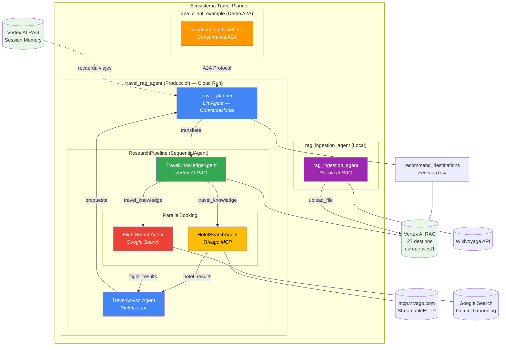
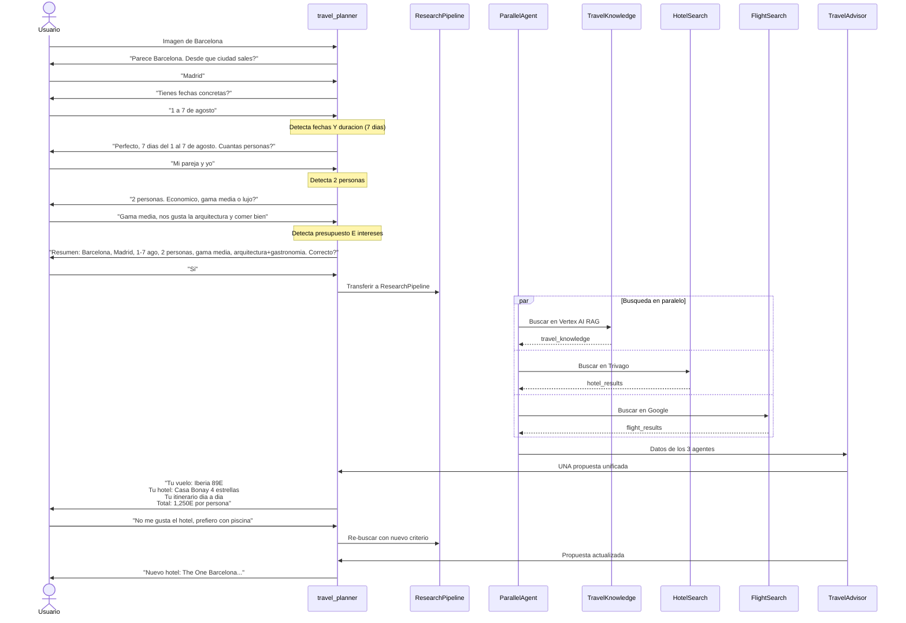
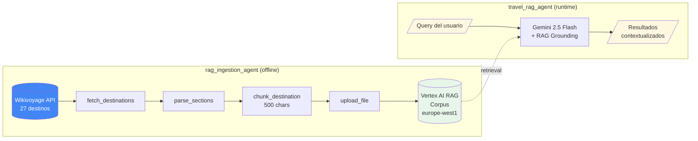
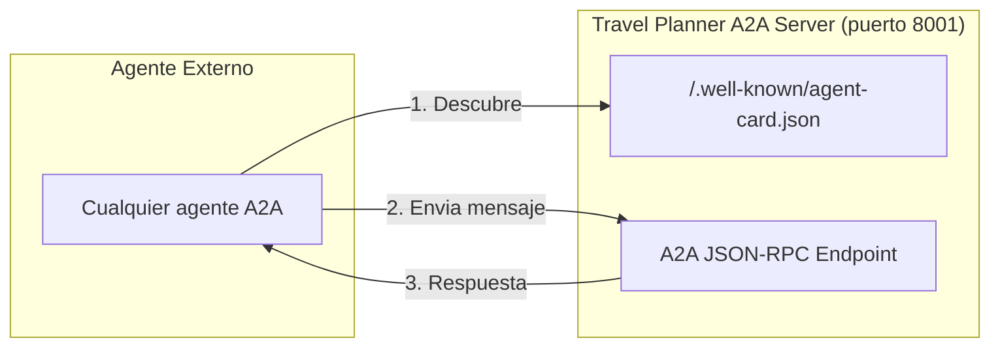

# Travel Planner — Ecosistema Multi-Agente

> **Google AI Hackathon — Desarrollo Agentico**
> Premisa: Generar información de viajes desde una imagen vista en redes sociales

## Visión General

Un usuario ve una foto de Barcelona en Instagram y quiere viajar ahí. Pega la imagen en nuestro agente y este:

1. **Identifica el destino** usando Gemini Vision (multimodal). Si es genérico, usa `recommend_destinations` sobre nuestro RAG
2. **Entrevista inteligente** — pregunta solo lo que no sabe, una pregunta a la vez
3. **Pipeline**: RAG (nuestro catálogo) → hoteles + vuelos en paralelo → advisor
4. **Presenta UNA propuesta unificada** con vuelo + hotel + itinerario + presupuesto + links de reserva
5. **Permite refinamiento**: si no le gusta, pide cambios y re-busca
6. **Expuesto via A2A**: otros agentes pueden consumirlo como servicio remoto
7. **Session Memory**: recuerda viajes anteriores entre sesiones (Vertex AI RAG Memory)

---

## Ecosistema de Agentes



---

## 3 Proyectos, 1 Ecosistema

| Proyecto | Rol | Deploy |
|----------|-----|--------|
| `travel_rag_agent` | Agente de viajes principal — entrevista + búsqueda + propuesta | Cloud Run + A2A |
| `rag_ingestion_agent` | Puebla Vertex AI RAG con datos de Wikivoyage | Solo local |
| `a2a_client_example` | Demo: bot de redes sociales que consume el travel planner via A2A | Solo local |

---

## Arquitectura de `travel_rag_agent`

### Agentes (cada uno con su propio modelo y skill)

| Agente | Modelo | Skill | Tools | Output Key |
|--------|--------|-------|-------|------------|
| `travel_planner` | MODEL_ROOT | root.md | recommend_destinations (FunctionTool) | — |
| `TravelKnowledgeAgent` | MODEL_KNOWLEDGE | knowledge.md | search_travel_knowledge (FunctionTool) | `travel_knowledge` |
| `HotelSearchAgent` | MODEL_HOTELS | hotels.md | Trivago McpToolset | `hotel_results` |
| `FlightSearchAgent` | MODEL_FLIGHTS | flights.md | google_search | `flight_results` |
| `TravelAdvisorAgent` | MODEL_ADVISOR | advisor.md | ninguno (sintetiza) | — |

> **Decisiones clave**:
> - Cada agente tiene sus propios tools (Vertex AI no permite mezclar `google_search` con `FunctionTool`)
> - Cada agente puede usar un modelo diferente via env vars (`MODEL_ROOT`, `MODEL_ADVISOR`, etc.)
> - El comportamiento de cada agente se define en archivos Markdown con frontmatter (editables sin tocar Python)

### Skills System

```
skills/
├── base.py           # Loader — parse frontmatter + body del .md
├── root.md           # Entrevista conversacional + seguimiento
├── knowledge.md      # Estrategia de búsqueda RAG
├── hotels.md         # Criterios de búsqueda Trivago
├── flights.md        # Estrategia Google Search vuelos
└── advisor.md        # Síntesis + tono inspirador + formato propuesta
```

Formato de cada skill:
```markdown
---
name: Travel Advisor Senior
description: Sintetiza la investigación en UNA propuesta
agent: TravelAdvisorAgent
version: "1.0"
---

(El instruction del agente es el cuerpo del .md)
```

---

## Flujo Conversacional



---

## Pipeline RAG



### Datos del RAG

| Metrica | Valor |
|---------|-------|
| Backend | Vertex AI RAG Engine (managed) |
| Region | europe-west1 |
| Destinos | 27 (global) |
| Modelo embedding | text-embedding-004 (768 dims) |
| Corpus ID | `projects/616890188730/locations/europe-west1/ragCorpora/6917529027641081856` |

### Destinos cubiertos

**Europa**: Paris, Barcelona, Rome, Amsterdam, Prague, Lisbon, Istanbul, Dubrovnik, Santorini, Edinburgh
**Asia**: Tokyo, Bangkok, Bali, Kyoto, Seoul, Hanoi, Singapore
**Americas**: New York City, Buenos Aires, Mexico City, Rio de Janeiro, Havana
**Africa/Medio Oriente**: Marrakech, Cape Town, Nairobi
**Oceania**: Sydney, Queenstown

---

## A2A Protocol

El travel planner se expone como servidor A2A, permitiendo que cualquier agente lo consuma.



**Agent Card** publicada en `http://host:8001/.well-known/agent-card.json`:
- Nombre: Travel Planner Agent
- Skills: Travel Planning
- Input: text/plain, image/*
- Protocolo: JSON-RPC v0.3.0

**Ejemplo de consumo** (en `a2a_client_example/`):
```python
from google.adk.agents.remote_a2a_agent import RemoteA2aAgent

travel_planner = RemoteA2aAgent(
    name="travel_planner",
    agent_card="http://host:8001/.well-known/agent-card.json",
)
```

---

## Session Memory

Las conversaciones se persisten en un corpus Vertex AI RAG dedicado, permitiendo al agente recordar viajes previos del usuario entre sesiones.

| Componente | Valor |
|-----------|-------|
| Servicio | VertexAiRagMemoryService |
| Corpus ID | `7991637538768945152` |
| Region | europe-west1 |
| Activacion | `adk web --memory_service_uri "rag://7991637538768945152"` |

---

## Stack Tecnologico

| Capa | Tecnologia | Version |
|------|-----------|---------|
| **Orquestacion** | Google ADK | 1.25.0 |
| **LLM** | Gemini 2.5 Flash (Vertex AI) | gemini-2.5-flash |
| **RAG** | Vertex AI RAG Engine (managed) | europe-west1 |
| **MCP (Hoteles)** | Trivago MCP | StreamableHTTP |
| **Vuelos** | Google Search (ADK built-in) | Gemini Grounding |
| **A2A** | Agent2Agent Protocol | v0.3.0 |
| **Memory** | Vertex AI RAG Memory | europe-west1 |
| **Skills** | Markdown + YAML frontmatter | Custom loader |
| **Runtime** | Python | 3.14 |
| **Deploy** | Cloud Run | europe-west1 |

---

## Estructura del Proyecto

```
aws/
├── .env                              # Config global (Vertex AI)
├── ARCHITECTURE.md                   # Este archivo
│
├── travel_rag_agent/                 # Agente principal (produccion)
│   ├── agent.py                      # Composicion multi-agente
│   ├── a2a_server.py                 # Servidor A2A (puerto 8001)
│   ├── requirements.txt              # Dependencias para deploy
│   ├── .env                          # Config del agente
│   ├── agents/                       # Sub-agentes (1 fichero cada uno)
│   │   ├── models.py                 # Modelo por agente (env vars)
│   │   ├── travel_knowledge.py       # Vertex AI RAG
│   │   ├── hotel_search.py           # Trivago MCP
│   │   ├── flight_search.py          # Google Search
│   │   └── travel_advisor.py         # Sintetizador
│   └── skills/                       # Comportamiento (Markdown editables)
│       ├── base.py                   # Loader frontmatter
│       ├── root.md                   # Entrevista conversacional
│       ├── knowledge.md              # Estrategia RAG
│       ├── hotels.md                 # Criterios Trivago
│       ├── flights.md                # Busqueda vuelos
│       └── advisor.md                # Sintesis + formato propuesta
│
├── rag_ingestion_agent/              # Agente de datos (solo local)
│   ├── agent.py                      # "Anade Barcelona y Roma"
│   ├── .env                          # Config
│   ├── data/                         # Wikivoyage parser + chunker
│   │   ├── schema.py                 # TravelChunk (Pydantic)
│   │   ├── wikivoyage.py             # MediaWiki API fetcher
│   │   └── chunker.py               # Recursive text splitter
│   ├── pipeline/
│   │   └── ingest.py                 # Pipeline offline
│   └── tools/
│       └── wikivoyage_tool.py        # fetch + upload a Vertex AI RAG
│
└── a2a_client_example/               # Demo cliente A2A
    ├── agent.py                      # Bot redes sociales → RemoteA2aAgent
    └── .env                          # Config
```

---

## Estado Actual

### Funcional
- [x] Vertex AI RAG managed (27 destinos, europe-west1)
- [x] RAG Ingestion Agent separado (puebla el corpus via Wikivoyage)
- [x] 5 sub-agentes con modelos configurables independientemente
- [x] Skills system (Markdown con frontmatter, editables sin tocar Python)
- [x] Entrevista inteligente (no repite preguntas si ya tiene la info)
- [x] Trivago MCP (hoteles con precios y links)
- [x] Google Search (vuelos con precios)
- [x] Busqueda paralela (3 agentes simultaneos)
- [x] TravelAdvisorAgent: UNA propuesta unificada (no listas)
- [x] Refinamiento post-propuesta (usuario pide cambios)
- [x] Multimodal (imagen a destino via Gemini Vision)
- [x] A2A Protocol (server + client example)
- [x] Session Memory (Vertex AI RAG Memory, persiste entre sesiones)
- [x] Cloud Run deploy (en progreso)
- [x] ARCHITECTURE.md con diagramas Mermaid

### Limitaciones conocidas
- Vuelos via Google Search (precios aproximados, no API de aerolineas)
- Trivago MCP puede tener timeouts ocasionales
- No hay booking real (solo links de reserva)
- Queenstown tiene solo 1 chunk (datos incompletos)

---

## Setup y Ejecucion

### Requisitos
```bash
gcloud auth application-default login
gcloud services enable aiplatform.googleapis.com run.googleapis.com --project=YOUR_PROJECT
```

### Variables de entorno (cada `.env`)
```
GOOGLE_GENAI_USE_VERTEXAI=TRUE
GOOGLE_CLOUD_PROJECT=workshop-adk-boris
GOOGLE_CLOUD_LOCATION=europe-west1
GEMINI_MODEL=gemini-2.5-flash
RAG_CORPUS=projects/616890188730/locations/europe-west1/ragCorpora/6917529027641081856
```

### Anadir destinos al RAG
```bash
adk web .
# Selecciona rag_ingestion_agent
# "Anade Viena, Budapest y Praga"
```

### Ejecutar local
```bash
adk web --memory_service_uri "rag://7991637538768945152" .
# http://localhost:8000 → travel_rag_agent
```

### Servidor A2A
```bash
uvicorn travel_rag_agent.a2a_server:a2a_app --host 0.0.0.0 --port 8001
# Agent Card: http://localhost:8001/.well-known/agent-card.json
```

### Deploy a Cloud Run
```bash
adk deploy cloud_run --project=workshop-adk-boris --region=europe-west1 --with_ui travel_rag_agent -- --allow-unauthenticated
```

---

## Decisiones Tecnicas

| Decision | Elegido | Alternativa | Razon |
|----------|---------|-------------|-------|
| RAG | Vertex AI RAG (managed) | numpy in-memory | Produccion, auto-scaling, sin local state |
| Region | europe-west1 | us-central1 | us-central1 tiene restriccion Spanner para nuevos proyectos |
| Datos | Wikivoyage API | mindtrip.ai | mindtrip bloquea bots + SPA |
| MCP Hotels | Trivago (oficial) | Booking.com MCP | Sin auth, endpoint publico |
| Vuelos | Google Search | Amadeus, SerpAPI | Zero cuentas extra, gratis en GCP |
| Tool separation | 1 tool por agente | Mixed tools | Vertex AI no permite mezclar google_search con FunctionTool |
| Skills | Markdown + frontmatter | Python hardcoded | Editables sin tocar codigo, versionables |
| Modelos | Configurable por agente | Mismo modelo para todos | Optimizar coste/calidad por tarea |
| Propuesta | UNA mejor opcion | Listas de 10 | Evita paralisis de eleccion |
| A2A | Server expuesto | Solo local | Demuestra interoperabilidad en el hackathon |
| Memory | Vertex AI RAG Memory | In-memory | Persiste entre sesiones y reinicios |
