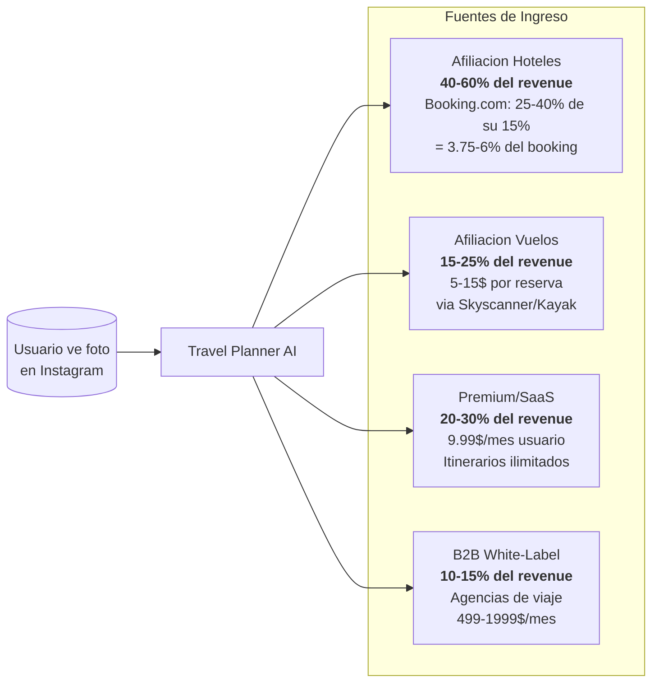
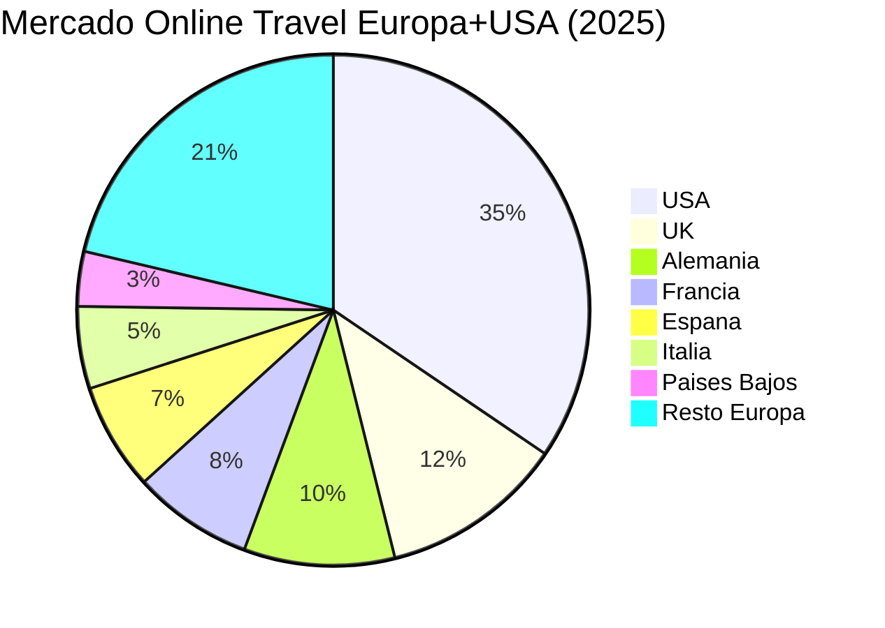
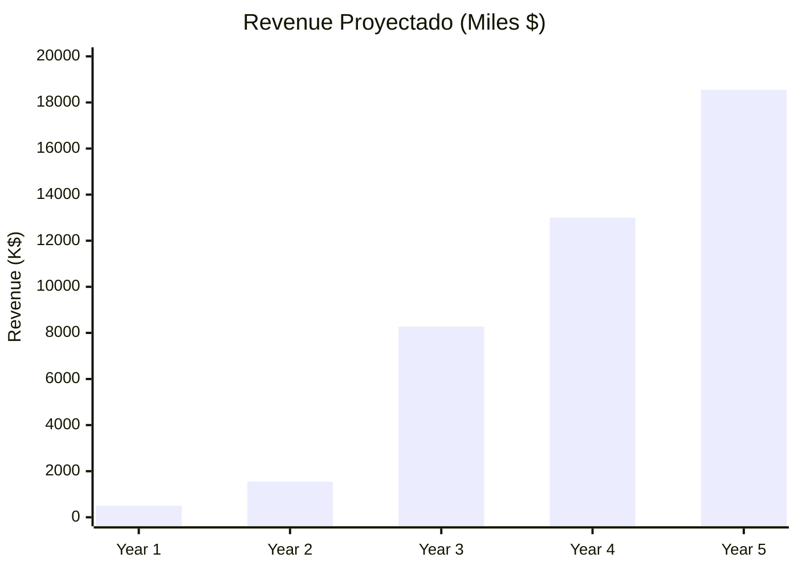

# Travel Planner AI — Plan de Negocio

## Modelo de Negocio

### Revenue Streams

| Stream | Comision/Precio | % Revenue estimado |
|--------|----------------|-------------------|
| **Afiliacion hoteles** | 3.75-6% del booking (via Booking.com/Trivago) | 40-60% |
| **Afiliacion vuelos** | 5-15$ por reserva (via Skyscanner/Kayak) | 15-25% |
| **Suscripcion Premium** | 9.99$/mes (itinerarios ilimitados, precios alertas) | 20-30% |
| **B2B SaaS** | 499-1,999$/mes (agencias de viaje, white-label) | 10-15% |

### Metricas Clave

| Metrica | Valor conservador | Valor optimista |
|---------|-------------------|-----------------|
| Valor medio reserva hotel | 150$/noche x 4 noches = 600$ | 250$/noche x 5 noches = 1,250$ |
| Comision media por booking hotel | 22.50$ (3.75%) | 75$ (6%) |
| Comision media por vuelo | 8$ | 15$ |
| Conversion imagen → reserva | 2% | 5% |
| Revenue por usuario activo/mes | 3.50$ | 12$ |

---

## Mercado por Pais

### Datos del mercado (2025-2026)

El mercado global OTA es de **~664 mil millones $**. Europa representa el 32% (~196B$), USA el 34% (~67.7B$ solo USA).

### Estimacion de Revenue por Pais

**Escenario conservador**: 0.001% de captura del mercado OTA en cada pais (Year 1-2).
**Escenario realista**: 0.005% de captura (Year 3).
**Escenario optimista**: 0.01% de captura (Year 4-5).

Estos porcentajes son realistas para una startup AI travel en fase inicial. Referencia: las startups AI travel que reciben inversion en 2026 proyectan 0.01-0.05% de captura en Year 3-5.

#### Year 1-2: Lanzamiento (0.001% captura)

| Pais | Mercado OTA (B$) | Captura 0.001% | Revenue anual | Revenue mensual |
|------|-------------------|----------------|---------------|-----------------|
| **USA** | 67.7B$ | 0.001% | **677,000$** | 56,400$ |
| **UK** | 22.8B$ | 0.001% | **228,000$** | 19,000$ |
| **Alemania** | 18.7B$ | 0.001% | **187,000$** | 15,600$ |
| **Francia** | 14.9B$ | 0.001% | **149,000$** | 12,400$ |
| **Espana** | 13.3B$ | 0.001% | **133,000$** | 11,100$ |
| **Italia** | 10.2B$ | 0.001% | **102,000$** | 8,500$ |
| **Paises Bajos** | 6.8B$ | 0.001% | **68,000$** | 5,700$ |
| **TOTAL** | | | **1,544,000$** | **128,700$** |

#### Year 3: Crecimiento (0.005% captura)

| Pais | Mercado OTA (B$) | Captura 0.005% | Revenue anual |
|------|-------------------|----------------|---------------|
| **USA** | 72B$ | 0.005% | **3,600,000$** |
| **UK** | 24B$ | 0.005% | **1,200,000$** |
| **Alemania** | 20B$ | 0.005% | **1,000,000$** |
| **Francia** | 16B$ | 0.005% | **800,000$** |
| **Espana** | 15B$ | 0.005% | **750,000$** |
| **Italia** | 11B$ | 0.005% | **550,000$** |
| **Paises Bajos** | 7.5B$ | 0.005% | **375,000$** |
| **TOTAL** | | | **8,275,000$** |

#### Year 5: Escala (0.01% captura)

| Pais | Mercado OTA (B$) | Captura 0.01% | Revenue anual |
|------|-------------------|---------------|---------------|
| **USA** | 80B$ | 0.01% | **8,000,000$** |
| **UK** | 27B$ | 0.01% | **2,700,000$** |
| **Alemania** | 22B$ | 0.01% | **2,200,000$** |
| **Francia** | 18B$ | 0.01% | **1,800,000$** |
| **Espana** | 17B$ | 0.01% | **1,700,000$** |
| **Italia** | 13B$ | 0.01% | **1,300,000$** |
| **Paises Bajos** | 8.5B$ | 0.01% | **850,000$** |
| **TOTAL** | | | **18,550,000$** |

---

## Proyeccion a 5 anos

| Ano | Revenue | Usuarios activos | Equipo | Costes GCP |
|-----|---------|-----------------|--------|-----------|
| Year 1 | 500K$ | 15,000 | 3 personas | 2,000$/mes |
| Year 2 | 1.5M$ | 50,000 | 6 personas | 8,000$/mes |
| Year 3 | 8.3M$ | 200,000 | 15 personas | 25,000$/mes |
| Year 4 | 13M$ | 400,000 | 25 personas | 50,000$/mes |
| Year 5 | 18.5M$ | 700,000 | 40 personas | 80,000$/mes |

---

## Costes Operativos

### Costes Google Cloud (por usuario activo/mes)

| Servicio | Coste estimado | Notas |
|----------|---------------|-------|
| Gemini 2.5 Flash | ~0.01$/query | ~5 queries por sesion |
| Vertex AI RAG | ~0.005$/query | Retrieval + embedding |
| Cloud Run | ~0.001$/request | Auto-scaling |
| **Total por sesion** | **~0.08$** | 5 queries LLM + RAG + compute |
| **Total por usuario/mes** | **~0.40$** | ~5 sesiones/mes |

### Margen

| Metrica | Valor |
|---------|-------|
| Revenue por usuario/mes (conservador) | 3.50$ |
| Coste GCP por usuario/mes | 0.40$ |
| **Margen bruto** | **~89%** |

Los costes de LLM son la mayor partida pero Gemini Flash es significativamente mas barato que GPT-4 o Claude para este tipo de uso.

---

## Estrategia de Go-to-Market por Pais

### Fase 1: Espana + LATAM (Month 1-6)
- **Por que**: Agente ya responde en espanol, menor competencia en AI travel
- **Canal**: Instagram/TikTok (integracion con la premisa de "imagen de red social")
- **Objetivo**: 5,000 usuarios, validar conversion

### Fase 2: UK + USA (Month 6-12)
- **Por que**: Mercados mas grandes, mayor gasto medio por viaje
- **Canal**: Chrome extension, Instagram bot, partnership con influencers de viaje
- **Objetivo**: 30,000 usuarios, revenue 500K$

### Fase 3: Alemania + Francia + Italia (Month 12-18)
- **Por que**: Mercados grandes con alta penetracion digital
- **Requisito**: Skills en aleman, frances, italiano (solo cambiar el .md del skill)
- **Canal**: B2B con agencias de viaje locales (white-label)
- **Objetivo**: 100,000 usuarios, revenue 2M$

### Fase 4: Expansion + B2B (Month 18-36)
- **Paises Bajos, Nordicos, Europa del Este**
- **B2B SaaS** para agencias de viaje y TMCs (Travel Management Companies)
- **A2A Protocol** para integracion con otros agentes del ecosistema

---

## Ventaja Competitiva

| Factor | Nosotros | OTAs tradicionales (Booking, Expedia) | Otros AI travel (Mindtrip, Layla) |
|--------|----------|--------------------------------------|----------------------------------|
| Entrada | Imagen de red social | Busqueda manual | Texto |
| Experiencia | Conversacional, UNA propuesta | 1000 opciones, paralisis | Listas de opciones |
| Personalización | Entrevista inteligente | Filtros manuales | Limitada |
| Interoperabilidad | A2A + MCP | APIs cerradas | Ninguna |
| Multi-fuente | RAG + Trivago + Google | Solo su inventario | 1-2 fuentes |
| Coste infra | ~0.08$/sesion (Gemini Flash) | Infra legacy masiva | GPT-4 (~0.50$/sesion) |

---

## Inversion Necesaria

### Seed Round (500K-1M$)

| Concepto | Cantidad | Uso |
|----------|----------|-----|
| Equipo (3 personas, 12 meses) | 360,000$ | 2 devs + 1 growth |
| GCP credits | 50,000$ | Primeros 12 meses |
| Marketing | 80,000$ | Influencer partnerships + ads |
| Legal + ops | 30,000$ | Incorporacion, afiliacion Booking.com |
| **TOTAL** | **520,000$** | |

### KPIs para Series A
- 50,000 MAU
- 500K$ ARR
- 3% conversion imagen → reserva
- Unit economics positivos (LTV > 3x CAC)

---

## Riesgos

| Riesgo | Probabilidad | Impacto | Mitigacion |
|--------|-------------|---------|-----------|
| Booking.com/Trivago cambian programa afiliados | Media | Alto | Diversificar fuentes (Amadeus, hoteles directos) |
| Google lanza producto competidor | Alta | Alto | A2A + MCP hacen que seamos complementarios, no competidores |
| Regulacion AI en EU (AI Act) | Media | Medio | Compliance by design (no datos personales, transparencia) |
| Costes LLM suben | Baja | Medio | Modelos configurables por agente (ya implementado) |
| Baja conversion | Media | Alto | Iterar skills y flujo conversacional sin tocar codigo |

---

## Fuentes

- [Grand View Research - OTA Market 2033](https://www.grandviewresearch.com/industry-analysis/online-travel-agencies-market-report)
- [Mordor Intelligence - Europe Online Travel](https://www.mordorintelligence.com/industry-reports/online-travel-market-in-europe)
- [Booking.com Affiliate Commission](https://affiliates.support.booking.com/kb/s/article/Commission-and-Payments)
- [AI Travel Monetization 2026](https://www.getchatads.com/blog/comparing-six-ai-travel-planning-agent-monetization-solutions/)
- [Skift - Global Online Travel 2025](https://research.skift.com/reports/global-online-travel-sector-market-estimates-2025/)
